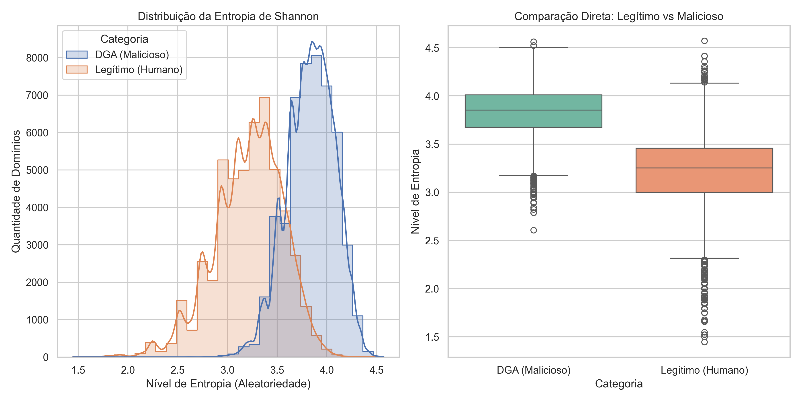

# Detecção de Tráfego C2 via DGA com Deep Learning 🛡️🧠

Este repositório contém o código-fonte e os datasets utilizados no pré-projeto de TCC intitulado: **"Detecção de Tráfego de Command & Control (C2) via Classificação de Domínios Gerados por Algoritmos (DGA) utilizando Deep Learning"**.

## 🎯 Objetivo
Demonstrar a viabilidade de utilizar Redes Neurais (LSTM) para classificar nomes de domínio como "Legítimos" ou "Maliciosos" com base apenas em padrões textuais, superando métodos baseados apenas em Entropia de Shannon.

## 📂 Estrutura do Projeto
* `coleta_dados.py`: Script responsável por baixar a *Tranco List* (Legítimos) e gerar dados sintéticos de DGA para treinamento.
* `analise_dados.py`: Realiza a Análise Exploratória de Dados (EDA) e gera gráficos de entropia.
* `dataset_mestrado.csv`: Dataset processado contendo 100.000 domínios classificados.
* `figura_1_viabilidade.png`: Resultado visual da separação de classes via Entropia.

## 🚀 Resultados Preliminares
A análise inicial demonstrou que domínios legítimos e maliciosos possuem distribuições de entropia distintas, porém com uma zona de intersecção crítica que justifica o uso de Deep Learning.



## 🛠️ Tecnologias
* Python 3.11
* Pandas
* Scikit-Learn
* Seaborn / Matplotlib
* Tldextract

## 📄 Como reproduzir
```bash
pip install pandas seaborn matplotlib tldextract
python coleta_dados.py
python analise_dados.py
